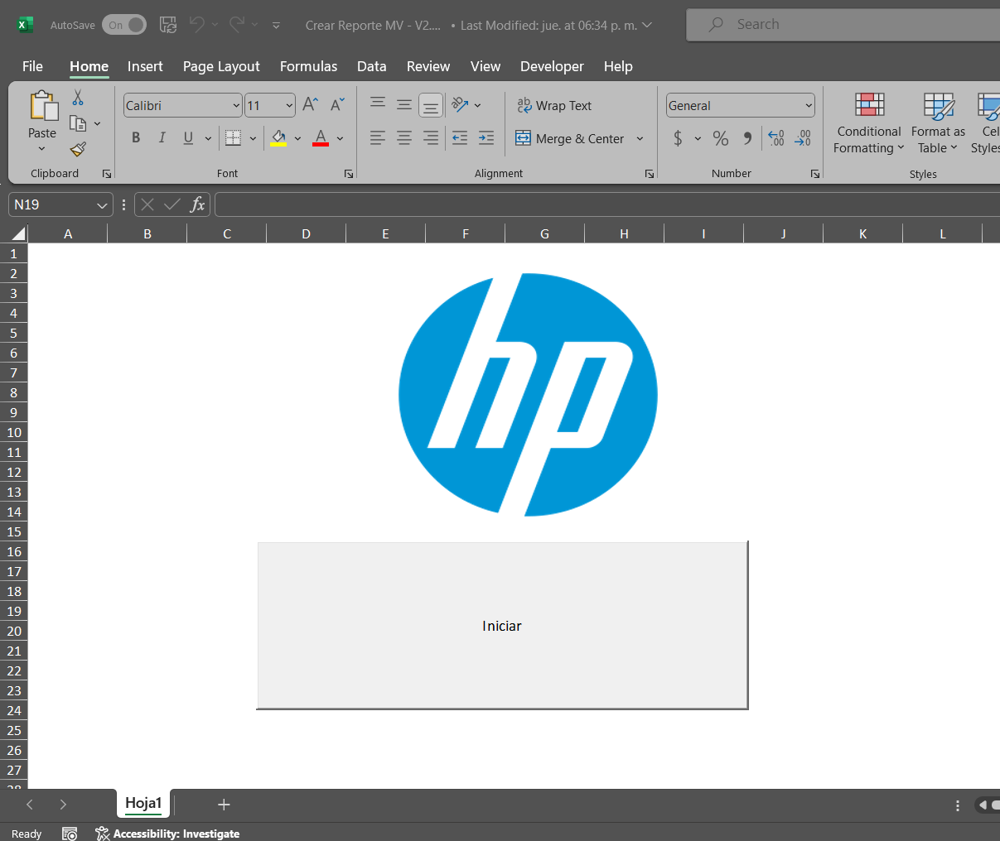
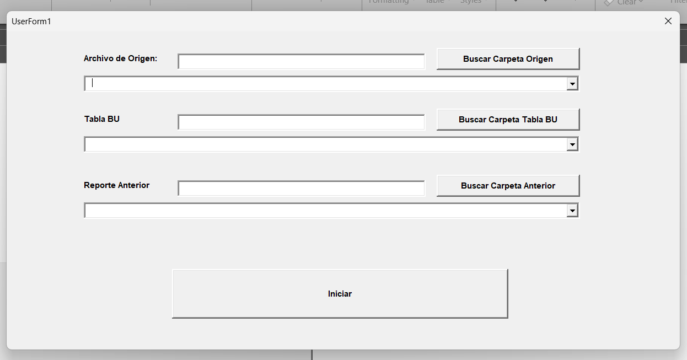
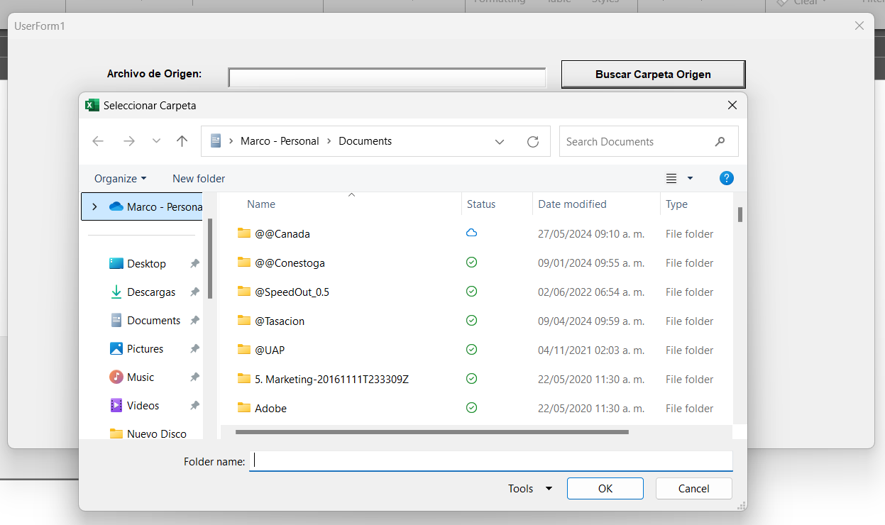

# MacroInventory
Macro to automate a repetitive task.


## Description
This project is a VBA macro excel that allowed us to consolidate and track reports from our supplier UPS.


## Table of Contents
1. [Background](#background)
2. [Technologies Used](#technologies-used)
3. [Preview](#preview)
4. [Features](#features)
5. [Code Snippets](#code-snippets)
   - [VBA](#vba)
6. [Contacts and Support](#contacts-and-support)


## Background
Internal client requested to automate a repetitive task in which he consolidated two reports: the UPS report in which the entire database came and additionally extracted from another report the columns that had already been worked on the previous day to only be able to work on the new orders.

## Technologies Used
The following technologies were used to develop this dashboard:
- **VBA Excel**: For programming code.


## Preview
   - First Screen
     
     
   - Initial Form
     
     
   - Search Folder
     

## Features
- VBA: Vba forms.


## Code Snippets

### VBA

In this section, I share some of the key methods and functions developed in VBA (Visual Basic for Applications) used throughout my projects:
- **Function to select path**:
  ```
  Function FnRuta()

    Dim Directorio As String
    
    With Application.FileDialog(msoFileDialogFolderPicker)
    
        .Title = "Seleccionar Carpeta"
        .Show
        Directorio = .SelectedItems(1)
    
    End With
    
    If Directorio <> "" Then
    
        FnRuta = Directorio
        
    Else
    
        FnRuta = "C:\"
    
    End If

  End Function
  ```
- **Method to get the files from the path**:
  ```
  Sub ListarArchivosInicio()

    Dim Ruta, Archivos As String
    Dim i As Integer
    
    'Abre cuadro de dialogo para abrir el archivo
    Ruta = FnRuta
    
    UserForm1.TXT_Carpeta.Text = Ruta
    
    Archivos = Dir(Ruta & "\")
    
    Do While Len(Archivos) > 0
    
        UserForm1.CB_Archivos.AddItem (Archivos)
        Archivos = Dir()
        
    Loop
    

  End Sub
  ```
- **Function to get the part number from the reports**:
  ```
  Function ExtraePN(ByVal Texto As String) As String

    Dim LongitudTexto As Integer
    Dim PN As String
    Dim VecesAparece As Integer
    Dim Posicion As Integer
    Dim Car As String
    Dim j As Integer
    Dim i As Integer
    
    LongitudTexto = Len(Texto)
    VecesAparece = 0
    Posicion = 0
    Car = ""
    
    'Contamos cuantas veces aparece PN
    For i = 1 To LongitudTexto
    
        Car = Mid(Texto, i, 1)
        
        If Car = "P" Then
        
            Car = Mid(Texto, i + 1, 1)
            
            If Car = "/" Then
            
                Car = Mid(Texto, i + 2, 1)
                
                If Car = "N" Then
                
                    VecesAparece = VecesAparece + 1
                    Posicion = i
        
                    If VecesAparece = 1 Then
        
                        j = i + 4
                        
                        Car = Mid(Texto, j, 1)
                        
                        Do While (Car <> ";")
                        
                            PN = PN + Car
                            
                            j = j + 1
                            
                            If j > LongitudTexto Then
                            
                                Car = ";"
                                
                            Else
                            
                                Car = Mid(Texto, j, 1)
                            
                            End If
                        
                        Loop
                        
                        Else
                        
                            j = i + 4
                            
                            Car = Mid(Texto, j, 1)
                            
                            PN = PN + " / "
                        
                            Do While (Car <> ";")
                        
                                PN = PN + Car
                            
                                j = j + 1
                            
                                If j > LongitudTexto Then
                            
                                    Car = ";"
                                
                                Else
                            
                                    Car = Mid(Texto, j, 1)
                            
                                End If
                        
                            Loop
        
                    End If
                
                End If
            
            End If
        
        End If
        
    Next i
    
    ExtraePN = PN
    
  End Function
  ```
- **Function to get the description from the reports**:
  ```
  Function ExtraeDescripcion(ByVal Texto As String) As String

    Dim LongitudTexto As Integer
    Dim Descripcion As String
    Dim VecesAparece As Integer
    Dim Posicion As Integer
    Dim Car As String
    Dim j As Integer
    Dim i As Integer
    
    LongitudTexto = Len(Texto)
    VecesAparece = 0
    Posicion = 0
    Car = ""
    
    'Contamos cuantas veces aparece PN
    For i = 1 To LongitudTexto
    
        Car = Mid(Texto, i, 1)
        
        If Car = "D" Then
        
            Car = Mid(Texto, i + 1, 1)
            
            If Car = "E" Then
            
                Car = Mid(Texto, i + 2, 1)
                
                If Car = "S" Then
                
                    Car = Mid(Texto, i + 3, 1)
                    
                    If Car = "C" Then
                    
                        Car = Mid(Texto, i + 4, 1)
                        
                        If Car = "R" Then
                        
                            Car = Mid(Texto, i + 5, 1)
                            
                            If Car = "I" Then
                            
                                Car = Mid(Texto, i + 6, 1)
                                
                                If Car = "P" Then
                                
                                    Car = Mid(Texto, i + 7, 1)
                                    
                                    If Car = "." Then
                                    
                                        Car = Mid(Texto, i + 8, 1)
                                        
                                        If Car = ":" Then
                                        
                                            VecesAparece = VecesAparece + 1
                                            Posicion = i
        
                                            If VecesAparece = 1 Then
        
                                                j = i + 9
                        
                                                Car = Mid(Texto, j, 1)
                        
                                                Do While (Car <> ";")
                        
                                                    Descripcion = Descripcion + Car
                            
                                                    j = j + 1
                            
                                                    If j > LongitudTexto Then
                            
                                                        Car = ";"
                                
                                                    Else
                            
                                                        Car = Mid(Texto, j, 1)
                            
                                                    End If
                        
                                                Loop
                        
                                            Else
                        
                                                j = i + 9
                            
                                                Car = Mid(Texto, j, 1)
                            
                                                Descripcion = Descripcion + " / "
                        
                                                Do While (Car <> ";")
                        
                                                    Descripcion = Descripcion + Car
                            
                                                    j = j + 1
                            
                                                    If j > LongitudTexto Then
                            
                                                        Car = ";"
                                
                                                    Else
                            
                                                        Car = Mid(Texto, j, 1)
                            
                                                    End If
                        
                                                Loop
        
                                            End If
                                        
                                        End If
                                    
                                    End If
                                
                                End If
                            
                            End If
                        
                        End If
                    
                    End If
                
                End If
            
            End If
        
        End If
        
    Next i
    
    ExtraeDescripcion = Descripcion
    
  End Function
  ```
## Contacts and Support
For any questions or support, contact [Marco Chang](mailto:marcochangbegazo@gmail.com).
